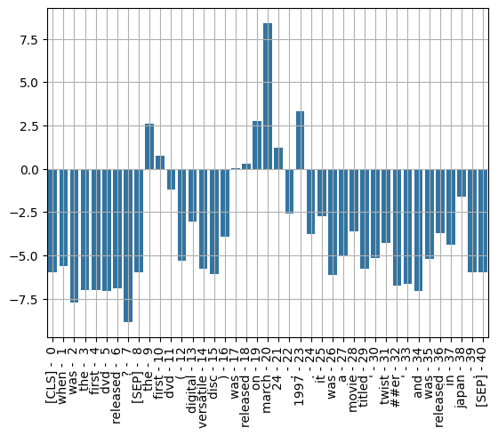
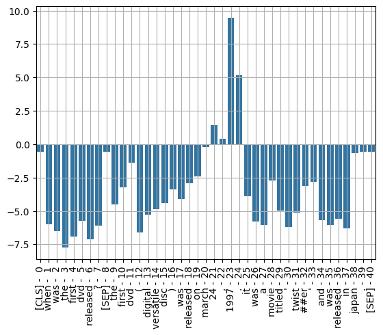

# BERT


```python
from transformers import BertForQuestionAnswering
from transformers import BertTokenizer
import torch
```


```python
model_name = "bert-large-uncased-whole-word-masking-finetuned-squad"
```


```python
model = BertForQuestionAnswering.from_pretrained(model_name)
```

    /usr/local/lib/python3.12/dist-packages/huggingface_hub/utils/_auth.py:93: UserWarning: 
    The secret `HF_TOKEN` does not exist in your Colab secrets.
    To authenticate with the Hugging Face Hub, create a token in your settings tab (https://huggingface.co/settings/tokens), set it as secret in your Google Colab and restart your session.
    You will be able to reuse this secret in all of your notebooks.
    Please note that authentication is recommended but still optional to access public models or datasets.
      warnings.warn(
    Warning: You are sending unauthenticated requests to the HF Hub. Please set a HF_TOKEN to enable higher rate limits and faster downloads.
    WARNING:huggingface_hub.utils._http:Warning: You are sending unauthenticated requests to the HF Hub. Please set a HF_TOKEN to enable higher rate limits and faster downloads.


    config.json:   0%|          | 0.00/443 [00:00<?, ?B/s]


    model.safetensors:   0%|          | 0.00/1.34G [00:00<?, ?B/s]


    Loading weights:   0%|          | 0/391 [00:00<?, ?it/s]


    BertForQuestionAnswering LOAD REPORT from: bert-large-uncased-whole-word-masking-finetuned-squad
    Key                      | Status     |  | 
    -------------------------+------------+--+-
    bert.pooler.dense.weight | UNEXPECTED |  | 
    bert.pooler.dense.bias   | UNEXPECTED |  | 
    
    Notes:
    - UNEXPECTED	:can be ignored when loading from different task/architecture; not ok if you expect identical arch.


```python
tokenizer = BertTokenizer.from_pretrained(model_name)
```


    tokenizer_config.json:   0%|          | 0.00/48.0 [00:00<?, ?B/s]


    vocab.txt: 0.00B [00:00, ?B/s]


    tokenizer.json: 0.00B [00:00, ?B/s]


# Embeddings


```python
question = "When was the first dvd released?"
answer_document = "The first DVD (Digital Versatile Disc) was released on March 24, 1997. It was a movie titled 'Twister' and was released in Japan."
```


```python
encoding = tokenizer(text=question,text_pair=answer_document)
```


```python
print(encoding)
```

    {'input_ids': [101, 2043, 2001, 1996, 2034, 4966, 2207, 1029, 102, 1996, 2034, 4966, 1006, 3617, 22979, 5860, 1007, 2001, 2207, 2006, 2233, 2484, 1010, 2722, 1012, 2009, 2001, 1037, 3185, 4159, 1005, 9792, 2121, 1005, 1998, 2001, 2207, 1999, 2900, 1012, 102], 'token_type_ids': [0, 0, 0, 0, 0, 0, 0, 0, 0, 1, 1, 1, 1, 1, 1, 1, 1, 1, 1, 1, 1, 1, 1, 1, 1, 1, 1, 1, 1, 1, 1, 1, 1, 1, 1, 1, 1, 1, 1, 1, 1], 'attention_mask': [1, 1, 1, 1, 1, 1, 1, 1, 1, 1, 1, 1, 1, 1, 1, 1, 1, 1, 1, 1, 1, 1, 1, 1, 1, 1, 1, 1, 1, 1, 1, 1, 1, 1, 1, 1, 1, 1, 1, 1, 1]}


```python
inputs = encoding['input_ids']
sentence_embedding = encoding['token_type_ids']
tokens = tokenizer.convert_ids_to_tokens(inputs)
```


```python
tokenizer.decode(101)
```


    '[CLS]'


```python
tokenizer.decode(102)
```


    '[SEP]'


```python
output = model(input_ids = torch.tensor([inputs]), token_type_ids = torch.tensor([sentence_embedding]))
```

# Model Output


```python
start_index = torch.argmax(output.start_logits)
end_index = torch.argmax(output.end_logits)

print(start_index)
print(end_index)
```

    tensor(20)
    tensor(23)


```python
answer = ' '.join(tokens[start_index:end_index+1])
print(answer)
```

    march 24 , 1997


```python
import matplotlib as plt
import seaborn as sns
```


```python
s_scores = output.start_logits.detach().numpy().flatten()
e_scores = output.end_logits.detach().numpy().flatten()
```


```python
token_labels = []
for (i, token) in enumerate(tokens):
  token_labels.append('{:} - {:>2}'.format(token, i))
```


```python
ax = sns.barplot(x=token_labels, y=s_scores)
ax.set_xticklabels(ax.get_xticklabels(), rotation=90, ha="center")
ax.grid(True)
```

    /tmp/ipykernel_1355/1538046351.py:2: UserWarning: set_ticklabels() should only be used with a fixed number of ticks, i.e. after set_ticks() or using a FixedLocator.
      ax.set_xticklabels(ax.get_xticklabels(), rotation=90, ha="center")


    

    


```python
ax = sns.barplot(x=token_labels, y=e_scores)
ax.set_xticklabels(ax.get_xticklabels(), rotation=90, ha="center")
ax.grid(True)
```

    /tmp/ipykernel_1355/365763533.py:2: UserWarning: set_ticklabels() should only be used with a fixed number of ticks, i.e. after set_ticks() or using a FixedLocator.
      ax.set_xticklabels(ax.get_xticklabels(), rotation=90, ha="center")


    

    


```python
sunset_motors_context = '''
Sunset Motors is a premier automobile dealership strategically located in the heart of downtown Miami, Florida. Spanning over 50,000 square feet, our state-of-the-art facility is one of the largest in the region, featuring a massive climate-controlled showroom and an advanced service center. We specialize in high-end performance and luxury vehicles, offering an extensive selection of Porsche, BMW, and Audi models. Whether you are looking for a sleek sports car or a sophisticated family SUV, our expansive inventory and prime location make Sunset Motors the ultimate destination for automotive enthusiasts.
'''
```


```python
def faq_bot(question):
  context = sunset_motors_context
  input_ids = tokenizer.encode(question, context)
  tokens = tokenizer.convert_ids_to_tokens(input_ids)
  sep_idx = input_ids.index(tokenizer.sep_token_id)
  num_seg_a = sep_idx+1
  num_seg_b = len(input_ids) - num_seg_a
  segment_ids = [0]*num_seg_a + [1]*num_seg_b
  output = model(torch.tensor([input_ids]), token_type_ids=torch.tensor([segment_ids]))
  answer_start = torch.argmax(output.start_logits)
  answer_end = torch.argmax(output.end_logits)
  if answer_end >= answer_start:
    answer = ' '.join(tokens[answer_start:answer_end+1])
  else:
    answer = "I am unable to find the answer to this question."
  corrected_answer = ''
  for word in answer.split():
    if word[0:2] == '##':
      corrected_answer += word[2:]
    else:
      corrected_answer += ' ' + word
  return corrected_answer
```


```python
faq_bot("Where is the dealership located?")
```


    ' downtown miami , florida'


```python
faq_bot("What make of cars are available?")
```


    ' porsche , bmw , and audi models'


```python
faq_bot("How large is the dealership?")
```


    ' over 50 , 000 square feet'


```python

```
