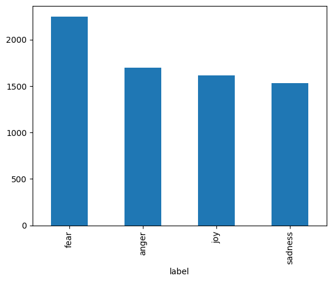
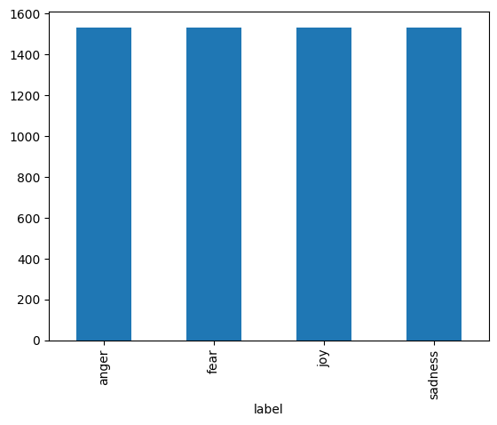

# Imports


```python
!pip install evaluate
!pip install emoji
```

    Collecting evaluate
      Downloading evaluate-0.4.6-py3-none-any.whl.metadata (9.5 kB)
    Requirement already satisfied: datasets>=2.0.0 in /usr/local/lib/python3.12/dist-packages (from evaluate) (4.0.0)
    Requirement already satisfied: numpy>=1.17 in /usr/local/lib/python3.12/dist-packages (from evaluate) (2.0.2)
    Requirement already satisfied: dill in /usr/local/lib/python3.12/dist-packages (from evaluate) (0.3.8)
    Requirement already satisfied: pandas in /usr/local/lib/python3.12/dist-packages (from evaluate) (2.2.2)
    Requirement already satisfied: requests>=2.19.0 in /usr/local/lib/python3.12/dist-packages (from evaluate) (2.32.4)
    Requirement already satisfied: tqdm>=4.62.1 in /usr/local/lib/python3.12/dist-packages (from evaluate) (4.67.3)
    Requirement already satisfied: xxhash in /usr/local/lib/python3.12/dist-packages (from evaluate) (3.6.0)
    Requirement already satisfied: multiprocess in /usr/local/lib/python3.12/dist-packages (from evaluate) (0.70.16)
    Requirement already satisfied: fsspec>=2021.05.0 in /usr/local/lib/python3.12/dist-packages (from fsspec[http]>=2021.05.0->evaluate) (2025.3.0)
    Requirement already satisfied: huggingface-hub>=0.7.0 in /usr/local/lib/python3.12/dist-packages (from evaluate) (1.11.0)
    Requirement already satisfied: packaging in /usr/local/lib/python3.12/dist-packages (from evaluate) (26.1)
    Requirement already satisfied: filelock in /usr/local/lib/python3.12/dist-packages (from datasets>=2.0.0->evaluate) (3.28.0)
    Requirement already satisfied: pyarrow>=15.0.0 in /usr/local/lib/python3.12/dist-packages (from datasets>=2.0.0->evaluate) (18.1.0)
    Requirement already satisfied: pyyaml>=5.1 in /usr/local/lib/python3.12/dist-packages (from datasets>=2.0.0->evaluate) (6.0.3)
    Requirement already satisfied: aiohttp!=4.0.0a0,!=4.0.0a1 in /usr/local/lib/python3.12/dist-packages (from fsspec[http]>=2021.05.0->evaluate) (3.13.5)
    Requirement already satisfied: hf-xet<2.0.0,>=1.4.3 in /usr/local/lib/python3.12/dist-packages (from huggingface-hub>=0.7.0->evaluate) (1.4.3)
    Requirement already satisfied: httpx<1,>=0.23.0 in /usr/local/lib/python3.12/dist-packages (from huggingface-hub>=0.7.0->evaluate) (0.28.1)
    Requirement already satisfied: typer in /usr/local/lib/python3.12/dist-packages (from huggingface-hub>=0.7.0->evaluate) (0.24.1)
    Requirement already satisfied: typing-extensions>=4.1.0 in /usr/local/lib/python3.12/dist-packages (from huggingface-hub>=0.7.0->evaluate) (4.15.0)
    Requirement already satisfied: charset_normalizer<4,>=2 in /usr/local/lib/python3.12/dist-packages (from requests>=2.19.0->evaluate) (3.4.7)
    Requirement already satisfied: idna<4,>=2.5 in /usr/local/lib/python3.12/dist-packages (from requests>=2.19.0->evaluate) (3.11)
    Requirement already satisfied: urllib3<3,>=1.21.1 in /usr/local/lib/python3.12/dist-packages (from requests>=2.19.0->evaluate) (2.5.0)
    Requirement already satisfied: certifi>=2017.4.17 in /usr/local/lib/python3.12/dist-packages (from requests>=2.19.0->evaluate) (2026.2.25)
    Requirement already satisfied: python-dateutil>=2.8.2 in /usr/local/lib/python3.12/dist-packages (from pandas->evaluate) (2.9.0.post0)
    Requirement already satisfied: pytz>=2020.1 in /usr/local/lib/python3.12/dist-packages (from pandas->evaluate) (2025.2)
    Requirement already satisfied: tzdata>=2022.7 in /usr/local/lib/python3.12/dist-packages (from pandas->evaluate) (2026.1)
    Requirement already satisfied: aiohappyeyeballs>=2.5.0 in /usr/local/lib/python3.12/dist-packages (from aiohttp!=4.0.0a0,!=4.0.0a1->fsspec[http]>=2021.05.0->evaluate) (2.6.1)
    Requirement already satisfied: aiosignal>=1.4.0 in /usr/local/lib/python3.12/dist-packages (from aiohttp!=4.0.0a0,!=4.0.0a1->fsspec[http]>=2021.05.0->evaluate) (1.4.0)
    Requirement already satisfied: attrs>=17.3.0 in /usr/local/lib/python3.12/dist-packages (from aiohttp!=4.0.0a0,!=4.0.0a1->fsspec[http]>=2021.05.0->evaluate) (26.1.0)
    Requirement already satisfied: frozenlist>=1.1.1 in /usr/local/lib/python3.12/dist-packages (from aiohttp!=4.0.0a0,!=4.0.0a1->fsspec[http]>=2021.05.0->evaluate) (1.8.0)
    Requirement already satisfied: multidict<7.0,>=4.5 in /usr/local/lib/python3.12/dist-packages (from aiohttp!=4.0.0a0,!=4.0.0a1->fsspec[http]>=2021.05.0->evaluate) (6.7.1)
    Requirement already satisfied: propcache>=0.2.0 in /usr/local/lib/python3.12/dist-packages (from aiohttp!=4.0.0a0,!=4.0.0a1->fsspec[http]>=2021.05.0->evaluate) (0.4.1)
    Requirement already satisfied: yarl<2.0,>=1.17.0 in /usr/local/lib/python3.12/dist-packages (from aiohttp!=4.0.0a0,!=4.0.0a1->fsspec[http]>=2021.05.0->evaluate) (1.23.0)
    Requirement already satisfied: anyio in /usr/local/lib/python3.12/dist-packages (from httpx<1,>=0.23.0->huggingface-hub>=0.7.0->evaluate) (4.13.0)
    Requirement already satisfied: httpcore==1.* in /usr/local/lib/python3.12/dist-packages (from httpx<1,>=0.23.0->huggingface-hub>=0.7.0->evaluate) (1.0.9)
    Requirement already satisfied: h11>=0.16 in /usr/local/lib/python3.12/dist-packages (from httpcore==1.*->httpx<1,>=0.23.0->huggingface-hub>=0.7.0->evaluate) (0.16.0)
    Requirement already satisfied: six>=1.5 in /usr/local/lib/python3.12/dist-packages (from python-dateutil>=2.8.2->pandas->evaluate) (1.17.0)
    Requirement already satisfied: click>=8.2.1 in /usr/local/lib/python3.12/dist-packages (from typer->huggingface-hub>=0.7.0->evaluate) (8.3.2)
    Requirement already satisfied: shellingham>=1.3.0 in /usr/local/lib/python3.12/dist-packages (from typer->huggingface-hub>=0.7.0->evaluate) (1.5.4)
    Requirement already satisfied: rich>=12.3.0 in /usr/local/lib/python3.12/dist-packages (from typer->huggingface-hub>=0.7.0->evaluate) (13.9.4)
    Requirement already satisfied: annotated-doc>=0.0.2 in /usr/local/lib/python3.12/dist-packages (from typer->huggingface-hub>=0.7.0->evaluate) (0.0.4)
    Requirement already satisfied: markdown-it-py>=2.2.0 in /usr/local/lib/python3.12/dist-packages (from rich>=12.3.0->typer->huggingface-hub>=0.7.0->evaluate) (4.0.0)
    Requirement already satisfied: pygments<3.0.0,>=2.13.0 in /usr/local/lib/python3.12/dist-packages (from rich>=12.3.0->typer->huggingface-hub>=0.7.0->evaluate) (2.20.0)
    Requirement already satisfied: mdurl~=0.1 in /usr/local/lib/python3.12/dist-packages (from markdown-it-py>=2.2.0->rich>=12.3.0->typer->huggingface-hub>=0.7.0->evaluate) (0.1.2)
    Downloading evaluate-0.4.6-py3-none-any.whl (84 kB)
       ━━━━━━━━━━━━━━━━━━━━━━━━━━━━━━━━━━━━━━━━ 84.1/84.1 kB 2.8 MB/s eta 0:00:00
    [?25hInstalling collected packages: evaluate
    Successfully installed evaluate-0.4.6
    Collecting emoji
      Downloading emoji-2.15.0-py3-none-any.whl.metadata (5.7 kB)
    Downloading emoji-2.15.0-py3-none-any.whl (608 kB)
       ━━━━━━━━━━━━━━━━━━━━━━━━━━━━━━━━━━━━━━━━ 608.4/608.4 kB 10.2 MB/s eta 0:00:00
    [?25hInstalling collected packages: emoji
    Successfully installed emoji-2.15.0


```python
import pandas as pd
import numpy as np
import re
from transformers import XLNetTokenizer, XLNetForSequenceClassification, TrainingArguments, Trainer, pipeline
import torch
from sklearn.model_selection import train_test_split
from sklearn.preprocessing import LabelEncoder
import datasets
import evaluate
import random
import emoji
```

# Preprocess our data


```python
data_train = pd.read_csv('186 - emotion-labels-train.csv')
data_test = pd.read_csv('186 - emotion-labels-test.csv')
data_val = pd.read_csv('186 - emotion-labels-val.csv')
```


```python
data_train.head()
```


  <div id="df-d2441ccf-d730-4f5e-b109-8df127ce464b" class="colab-df-container">
    <div>
<style scoped>
    .dataframe tbody tr th:only-of-type {
        vertical-align: middle;
    }

    .dataframe tbody tr th {
        vertical-align: top;
    }

    .dataframe thead th {
        text-align: right;
    }
</style>
<table border="1" class="dataframe">
  <thead>
    <tr style="text-align: right;">
      <th></th>
      <th>text</th>
      <th>label</th>
    </tr>
  </thead>
  <tbody>
    <tr>
      <th>0</th>
      <td>Just got back from seeing @GaryDelaney in Burs...</td>
      <td>joy</td>
    </tr>
    <tr>
      <th>1</th>
      <td>Oh dear an evening of absolute hilarity I don'...</td>
      <td>joy</td>
    </tr>
    <tr>
      <th>2</th>
      <td>Been waiting all week for this game ❤️❤️❤️ #ch...</td>
      <td>joy</td>
    </tr>
    <tr>
      <th>3</th>
      <td>@gardiner_love : Thank you so much, Gloria! Yo...</td>
      <td>joy</td>
    </tr>
    <tr>
      <th>4</th>
      <td>I feel so blessed to work with the family that...</td>
      <td>joy</td>
    </tr>
  </tbody>
</table>
</div>
    <div class="colab-df-buttons">

  <div class="colab-df-container">
    <button class="colab-df-convert" onclick="convertToInteractive('df-d2441ccf-d730-4f5e-b109-8df127ce464b')"
            title="Convert this dataframe to an interactive table."
            style="display:none;">

  <svg xmlns="http://www.w3.org/2000/svg" height="24px" viewBox="0 -960 960 960">
    <path d="M120-120v-720h720v720H120Zm60-500h600v-160H180v160Zm220 220h160v-160H400v160Zm0 220h160v-160H400v160ZM180-400h160v-160H180v160Zm440 0h160v-160H620v160ZM180-180h160v-160H180v160Zm440 0h160v-160H620v160Z"/>
  </svg>
    </button>

  <style>
    .colab-df-container {
      display:flex;
      gap: 12px;
    }

    .colab-df-convert {
      background-color: #E8F0FE;
      border: none;
      border-radius: 50%;
      cursor: pointer;
      display: none;
      fill: #1967D2;
      height: 32px;
      padding: 0 0 0 0;
      width: 32px;
    }

    .colab-df-convert:hover {
      background-color: #E2EBFA;
      box-shadow: 0px 1px 2px rgba(60, 64, 67, 0.3), 0px 1px 3px 1px rgba(60, 64, 67, 0.15);
      fill: #174EA6;
    }

    .colab-df-buttons div {
      margin-bottom: 4px;
    }

    [theme=dark] .colab-df-convert {
      background-color: #3B4455;
      fill: #D2E3FC;
    }

    [theme=dark] .colab-df-convert:hover {
      background-color: #434B5C;
      box-shadow: 0px 1px 3px 1px rgba(0, 0, 0, 0.15);
      filter: drop-shadow(0px 1px 2px rgba(0, 0, 0, 0.3));
      fill: #FFFFFF;
    }
  </style>

    <script>
      const buttonEl =
        document.querySelector('#df-d2441ccf-d730-4f5e-b109-8df127ce464b button.colab-df-convert');
      buttonEl.style.display =
        google.colab.kernel.accessAllowed ? 'block' : 'none';

      async function convertToInteractive(key) {
        const element = document.querySelector('#df-d2441ccf-d730-4f5e-b109-8df127ce464b');
        const dataTable =
          await google.colab.kernel.invokeFunction('convertToInteractive',
                                                    [key], {});
        if (!dataTable) return;

        const docLinkHtml = 'Like what you see? Visit the ' +
          '<a target="_blank" href=https://colab.research.google.com/notebooks/data_table.ipynb>data table notebook</a>'
          + ' to learn more about interactive tables.';
        element.innerHTML = '';
        dataTable['output_type'] = 'display_data';
        await google.colab.output.renderOutput(dataTable, element);
        const docLink = document.createElement('div');
        docLink.innerHTML = docLinkHtml;
        element.appendChild(docLink);
      }
    </script>
  </div>


    </div>
  </div>


```python
data = pd.concat([data_train, data_test, data_val], ignore_index=True)
```


```python
data['text_clean'] = data['text'].apply(lambda x: emoji.replace_emoji(x, ""))
```


```python
data['text_clean'] = data['text'].str.replace(r'@[^\s]+', '', regex=True)
```


```python
data.head(20)
```


  <div id="df-3482916c-65a3-42a1-917b-d657cc5cd900" class="colab-df-container">
    <div>
<style scoped>
    .dataframe tbody tr th:only-of-type {
        vertical-align: middle;
    }

    .dataframe tbody tr th {
        vertical-align: top;
    }

    .dataframe thead th {
        text-align: right;
    }
</style>
<table border="1" class="dataframe">
  <thead>
    <tr style="text-align: right;">
      <th></th>
      <th>text</th>
      <th>label</th>
      <th>text_clean</th>
    </tr>
  </thead>
  <tbody>
    <tr>
      <th>0</th>
      <td>Just got back from seeing @GaryDelaney in Burs...</td>
      <td>joy</td>
      <td>Just got back from seeing  in Burslem. AMAZING...</td>
    </tr>
    <tr>
      <th>1</th>
      <td>Oh dear an evening of absolute hilarity I don'...</td>
      <td>joy</td>
      <td>Oh dear an evening of absolute hilarity I don'...</td>
    </tr>
    <tr>
      <th>2</th>
      <td>Been waiting all week for this game ❤️❤️❤️ #ch...</td>
      <td>joy</td>
      <td>Been waiting all week for this game ❤️❤️❤️ #ch...</td>
    </tr>
    <tr>
      <th>3</th>
      <td>@gardiner_love : Thank you so much, Gloria! Yo...</td>
      <td>joy</td>
      <td>: Thank you so much, Gloria! You're so sweet,...</td>
    </tr>
    <tr>
      <th>4</th>
      <td>I feel so blessed to work with the family that...</td>
      <td>joy</td>
      <td>I feel so blessed to work with the family that...</td>
    </tr>
    <tr>
      <th>5</th>
      <td>Today I reached 1000 subscribers on YT!! , #go...</td>
      <td>joy</td>
      <td>Today I reached 1000 subscribers on YT!! , #go...</td>
    </tr>
    <tr>
      <th>6</th>
      <td>@Singaholic121 Good morning, love! Happy first...</td>
      <td>joy</td>
      <td>Good morning, love! Happy first day of fall. ...</td>
    </tr>
    <tr>
      <th>7</th>
      <td>#BridgetJonesBaby is the best thing I've seen ...</td>
      <td>joy</td>
      <td>#BridgetJonesBaby is the best thing I've seen ...</td>
    </tr>
    <tr>
      <th>8</th>
      <td>Just got back from seeing @GaryDelaney in Burs...</td>
      <td>joy</td>
      <td>Just got back from seeing  in Burslem. AMAZING...</td>
    </tr>
    <tr>
      <th>9</th>
      <td>@IndyMN I thought the holidays could not get a...</td>
      <td>joy</td>
      <td>I thought the holidays could not get any more...</td>
    </tr>
    <tr>
      <th>10</th>
      <td>I'm just still . So happy .\nA blast</td>
      <td>joy</td>
      <td>I'm just still . So happy .\nA blast</td>
    </tr>
    <tr>
      <th>11</th>
      <td>It's meant to be!! #happy #happy</td>
      <td>joy</td>
      <td>It's meant to be!! #happy #happy</td>
    </tr>
    <tr>
      <th>12</th>
      <td>💥⚖️Yeah‼️ PAUL‼️⚖️💥  #glorious #BB18</td>
      <td>joy</td>
      <td>💥⚖️Yeah‼️ PAUL‼️⚖️💥  #glorious #BB18</td>
    </tr>
    <tr>
      <th>13</th>
      <td>My morning started off amazing!! Hopefully the...</td>
      <td>joy</td>
      <td>My morning started off amazing!! Hopefully the...</td>
    </tr>
    <tr>
      <th>14</th>
      <td>😱 @cailamarsai you've had me 😂 😂 the whole tim...</td>
      <td>joy</td>
      <td>😱  you've had me 😂 😂 the whole time watching  ...</td>
    </tr>
    <tr>
      <th>15</th>
      <td>@iamTinaDatta love you so much #smile 😊😊</td>
      <td>joy</td>
      <td>love you so much #smile 😊😊</td>
    </tr>
    <tr>
      <th>16</th>
      <td>@WyoWiseGuy @LivingVertical however, REI did o...</td>
      <td>joy</td>
      <td>however, REI did offer me the job today as w...</td>
    </tr>
    <tr>
      <th>17</th>
      <td>2 days until #GoPackGo and 23 days until #GoGi...</td>
      <td>joy</td>
      <td>2 days until #GoPackGo and 23 days until #GoGi...</td>
    </tr>
    <tr>
      <th>18</th>
      <td>@TheMandyMoore You are beyond wonderful.  Your...</td>
      <td>joy</td>
      <td>You are beyond wonderful.  Your singing prowe...</td>
    </tr>
    <tr>
      <th>19</th>
      <td>@luckiiCHARM_ Luckii, I'm changing in so many ...</td>
      <td>joy</td>
      <td>Luckii, I'm changing in so many ways bc of Hi...</td>
    </tr>
  </tbody>
</table>
</div>
    <div class="colab-df-buttons">

  <div class="colab-df-container">
    <button class="colab-df-convert" onclick="convertToInteractive('df-3482916c-65a3-42a1-917b-d657cc5cd900')"
            title="Convert this dataframe to an interactive table."
            style="display:none;">

  <svg xmlns="http://www.w3.org/2000/svg" height="24px" viewBox="0 -960 960 960">
    <path d="M120-120v-720h720v720H120Zm60-500h600v-160H180v160Zm220 220h160v-160H400v160Zm0 220h160v-160H400v160ZM180-400h160v-160H180v160Zm440 0h160v-160H620v160ZM180-180h160v-160H180v160Zm440 0h160v-160H620v160Z"/>
  </svg>
    </button>

  <style>
    .colab-df-container {
      display:flex;
      gap: 12px;
    }

    .colab-df-convert {
      background-color: #E8F0FE;
      border: none;
      border-radius: 50%;
      cursor: pointer;
      display: none;
      fill: #1967D2;
      height: 32px;
      padding: 0 0 0 0;
      width: 32px;
    }

    .colab-df-convert:hover {
      background-color: #E2EBFA;
      box-shadow: 0px 1px 2px rgba(60, 64, 67, 0.3), 0px 1px 3px 1px rgba(60, 64, 67, 0.15);
      fill: #174EA6;
    }

    .colab-df-buttons div {
      margin-bottom: 4px;
    }

    [theme=dark] .colab-df-convert {
      background-color: #3B4455;
      fill: #D2E3FC;
    }

    [theme=dark] .colab-df-convert:hover {
      background-color: #434B5C;
      box-shadow: 0px 1px 3px 1px rgba(0, 0, 0, 0.15);
      filter: drop-shadow(0px 1px 2px rgba(0, 0, 0, 0.3));
      fill: #FFFFFF;
    }
  </style>

    <script>
      const buttonEl =
        document.querySelector('#df-3482916c-65a3-42a1-917b-d657cc5cd900 button.colab-df-convert');
      buttonEl.style.display =
        google.colab.kernel.accessAllowed ? 'block' : 'none';

      async function convertToInteractive(key) {
        const element = document.querySelector('#df-3482916c-65a3-42a1-917b-d657cc5cd900');
        const dataTable =
          await google.colab.kernel.invokeFunction('convertToInteractive',
                                                    [key], {});
        if (!dataTable) return;

        const docLinkHtml = 'Like what you see? Visit the ' +
          '<a target="_blank" href=https://colab.research.google.com/notebooks/data_table.ipynb>data table notebook</a>'
          + ' to learn more about interactive tables.';
        element.innerHTML = '';
        dataTable['output_type'] = 'display_data';
        await google.colab.output.renderOutput(dataTable, element);
        const docLink = document.createElement('div');
        docLink.innerHTML = docLinkHtml;
        element.appendChild(docLink);
      }
    </script>
  </div>


    </div>
  </div>


```python
data['label'].value_counts().plot(kind='bar')
```


    <Axes: xlabel='label'>


    

    


```python
g = data.groupby('label')
data = pd.DataFrame(g.apply(lambda x: x.sample(g.size().min()).reset_index(drop=True)))
```

    /tmp/ipykernel_1243/2135407547.py:2: DeprecationWarning: DataFrameGroupBy.apply operated on the grouping columns. This behavior is deprecated, and in a future version of pandas the grouping columns will be excluded from the operation. Either pass `include_groups=False` to exclude the groupings or explicitly select the grouping columns after groupby to silence this warning.
      data = pd.DataFrame(g.apply(lambda x: x.sample(g.size().min()).reset_index(drop=True)))


```python
data['label'].value_counts().plot(kind='bar')
```


    <Axes: xlabel='label'>


    

    


```python
data['label_int'] = LabelEncoder().fit_transform(data['label'])
```


```python
NUM_LABELS = 4
```


```python
train_split, test_split = train_test_split(data, train_size=0.8)
train_split, val_split = train_test_split(train_split, train_size=0.9)
```


```python
print(len(train_split))
print(len(test_split))
print(len(val_split))
```

    4414
    1227
    491


```python
train_df = pd.DataFrame({
    "label": train_split.label_int.values,
    "text": train_split.text_clean.values,
})

test_df = pd.DataFrame({
    "label": test_split.label_int.values,
    "text": test_split.text_clean.values,
})
```


```python
train_df = datasets.Dataset.from_dict(train_df)
test_df = datasets.Dataset.from_dict(test_df)
```


```python
dataset_dict = datasets.DatasetDict({"train": train_df, "test": test_df})
```


```python
dataset_dict
```


    DatasetDict({
        train: Dataset({
            features: ['label', 'text'],
            num_rows: 4414
        })
        test: Dataset({
            features: ['label', 'text'],
            num_rows: 1227
        })
    })


# Create embeddings


```python
tokenizer = XLNetTokenizer.from_pretrained('xlnet-base-cased')
```

    /usr/local/lib/python3.12/dist-packages/huggingface_hub/utils/_auth.py:93: UserWarning: 
    The secret `HF_TOKEN` does not exist in your Colab secrets.
    To authenticate with the Hugging Face Hub, create a token in your settings tab (https://huggingface.co/settings/tokens), set it as secret in your Google Colab and restart your session.
    You will be able to reuse this secret in all of your notebooks.
    Please note that authentication is recommended but still optional to access public models or datasets.
      warnings.warn(


    spiece.model:   0%|          | 0.00/798k [00:00<?, ?B/s]


    Warning: You are sending unauthenticated requests to the HF Hub. Please set a HF_TOKEN to enable higher rate limits and faster downloads.
    WARNING:huggingface_hub.utils._http:Warning: You are sending unauthenticated requests to the HF Hub. Please set a HF_TOKEN to enable higher rate limits and faster downloads.


    tokenizer.json: 0.00B [00:00, ?B/s]


```python
def tokenize_function(examples):
  return tokenizer(examples["text"], padding="max_length", max_length=128, truncation=True)
```


```python
tokenized_datasets = dataset_dict.map(tokenize_function, batched=True)
```


    Map:   0%|          | 0/4414 [00:00<?, ? examples/s]


    Map:   0%|          | 0/1227 [00:00<?, ? examples/s]


```python
tokenized_datasets
```


    DatasetDict({
        train: Dataset({
            features: ['label', 'text', 'input_ids', 'attention_mask'],
            num_rows: 4414
        })
        test: Dataset({
            features: ['label', 'text', 'input_ids', 'attention_mask'],
            num_rows: 1227
        })
    })


```python
print(tokenized_datasets['train']['text'][0])
```

    Will WHU be old bill free by the time the game with Chelsea comes around? 😂 😂 😂\nThat will be lively to say the least\n#AFC


```python
print(tokenized_datasets['train']['input_ids'][0])
```

    [5, 5, 5, 5, 5, 5, 5, 5, 5, 5, 5, 5, 5, 5, 5, 5, 5, 5, 5, 5, 5, 5, 5, 5, 5, 5, 5, 5, 5, 5, 5, 5, 5, 5, 5, 5, 5, 5, 5, 5, 5, 5, 5, 5, 5, 5, 5, 5, 5, 5, 5, 5, 5, 5, 5, 5, 5, 5, 5, 5, 5, 5, 5, 5, 5, 5, 5, 5, 5, 5, 5, 5, 5, 5, 5, 5, 5, 5, 5, 5, 5, 5, 5, 5, 5, 5, 5, 5, 2825, 543, 18315, 39, 532, 1325, 325, 37, 18, 92, 18, 275, 33, 7919, 909, 199, 82, 17, 0, 17, 0, 17, 0, 17666, 180, 1440, 53, 39, 17017, 22, 248, 18, 390, 17666, 180, 7967, 246, 9513, 4, 3]


```python
tokenizer.decode(5)
```


    '<pad>'


```python
print(tokenized_datasets['train']['attention_mask'][0])
```

    [0, 0, 0, 0, 0, 0, 0, 0, 0, 0, 0, 0, 0, 0, 0, 0, 0, 0, 0, 0, 0, 0, 0, 0, 0, 0, 0, 0, 0, 0, 0, 0, 0, 0, 0, 0, 0, 0, 0, 0, 0, 0, 0, 0, 0, 0, 0, 0, 0, 0, 0, 0, 0, 0, 0, 0, 0, 0, 0, 0, 0, 0, 0, 0, 0, 0, 0, 0, 0, 0, 0, 0, 0, 0, 0, 0, 0, 0, 0, 0, 0, 0, 0, 0, 0, 0, 0, 0, 1, 1, 1, 1, 1, 1, 1, 1, 1, 1, 1, 1, 1, 1, 1, 1, 1, 1, 1, 1, 1, 1, 1, 1, 1, 1, 1, 1, 1, 1, 1, 1, 1, 1, 1, 1, 1, 1, 1, 1]


```python
smal_train_dataset = tokenized_datasets["train"].shuffle(seed=42).select(range(100))
small_eval_dataset = tokenized_datasets["test"].shuffle(seed=42).select(range(100))
```

# Fine tune our model


```python
model = XLNetForSequenceClassification.from_pretrained('xlnet-base-cased',
                                                       num_labels=NUM_LABELS,
                                                       id2label={0: 'anger', 1: 'fear', 2: 'joy', 3: 'sadness'})
```


    config.json:   0%|          | 0.00/760 [00:00<?, ?B/s]


    pytorch_model.bin:   0%|          | 0.00/467M [00:00<?, ?B/s]


    model.safetensors:   0%|          | 0.00/467M [00:00<?, ?B/s]


    Loading weights:   0%|          | 0/206 [00:00<?, ?it/s]


    XLNetForSequenceClassification LOAD REPORT from: xlnet-base-cased
    Key                             | Status     | 
    --------------------------------+------------+-
    lm_loss.bias                    | UNEXPECTED | 
    lm_loss.weight                  | UNEXPECTED | 
    logits_proj.bias                | MISSING    | 
    sequence_summary.summary.bias   | MISSING    | 
    logits_proj.weight              | MISSING    | 
    sequence_summary.summary.weight | MISSING    | 
    
    Notes:
    - UNEXPECTED	:can be ignored when loading from different task/architecture; not ok if you expect identical arch.
    - MISSING	:those params were newly initialized because missing from the checkpoint. Consider training on your downstream task.


```python
metric = evaluate.load("accuracy")
```


    Downloading builder script: 0.00B [00:00, ?B/s]


```python
def compute_metrics(eval_pred):
  logits, labels = eval_pred
  predictions = np.argmax(logits, axis=-1)
  return metric.compute(predictions=predictions, references=labels)
```


```python
training_args = TrainingArguments(output_dir="test_trainer", eval_strategy="epoch", num_train_epochs=3)
```


```python
trainer = Trainer(
    model=model,
    args=training_args,
    train_dataset=smal_train_dataset,
    eval_dataset=small_eval_dataset,
    compute_metrics=compute_metrics,
)
```


```python
trainer.train()
```

    /usr/local/lib/python3.12/dist-packages/torch/utils/data/dataloader.py:775: UserWarning: 'pin_memory' argument is set as true but no accelerator is found, then device pinned memory won't be used.
      super().__init__(loader)


    <div>

      <progress value='39' max='39' style='width:300px; height:20px; vertical-align: middle;'></progress>
      [39/39 11:50, Epoch 3/3]
    </div>
    <table border="1" class="dataframe">
  <thead>
 <tr style="text-align: left;">
      <th>Epoch</th>
      <th>Training Loss</th>
      <th>Validation Loss</th>
      <th>Accuracy</th>
    </tr>
  </thead>
  <tbody>
    <tr>
      <td>1</td>
      <td>No log</td>
      <td>1.354688</td>
      <td>0.360000</td>
    </tr>
    <tr>
      <td>2</td>
      <td>No log</td>
      <td>1.339537</td>
      <td>0.290000</td>
    </tr>
    <tr>
      <td>3</td>
      <td>No log</td>
      <td>1.307026</td>
      <td>0.340000</td>
    </tr>
  </tbody>
</table><p>


    /usr/local/lib/python3.12/dist-packages/torch/utils/data/dataloader.py:775: UserWarning: 'pin_memory' argument is set as true but no accelerator is found, then device pinned memory won't be used.
      super().__init__(loader)
    /usr/local/lib/python3.12/dist-packages/torch/utils/data/dataloader.py:775: UserWarning: 'pin_memory' argument is set as true but no accelerator is found, then device pinned memory won't be used.
      super().__init__(loader)


    Writing model shards:   0%|          | 0/1 [00:00<?, ?it/s]


    /usr/local/lib/python3.12/dist-packages/torch/utils/data/dataloader.py:775: UserWarning: 'pin_memory' argument is set as true but no accelerator is found, then device pinned memory won't be used.
      super().__init__(loader)


    TrainOutput(global_step=39, training_loss=1.3489703643016326, metrics={'train_runtime': 729.4122, 'train_samples_per_second': 0.411, 'train_steps_per_second': 0.053, 'total_flos': 21366375321600.0, 'train_loss': 1.3489703643016326, 'epoch': 3.0})


# Evaluate model


```python
trainer.evaluate()
```

    /usr/local/lib/python3.12/dist-packages/torch/utils/data/dataloader.py:775: UserWarning: 'pin_memory' argument is set as true but no accelerator is found, then device pinned memory won't be used.
      super().__init__(loader)


<div>

  <progress value='13' max='13' style='width:300px; height:20px; vertical-align: middle;'></progress>
  [13/13 00:49]
</div>


    {'eval_loss': 1.3070259094238281,
     'eval_accuracy': 0.34,
     'eval_runtime': 53.5377,
     'eval_samples_per_second': 1.868,
     'eval_steps_per_second': 0.243,
     'epoch': 3.0}


```python
model.save_pretrained("fine_tuned_model")
```


    Writing model shards:   0%|          | 0/1 [00:00<?, ?it/s]


```python
fine_tuned_model = XLNetForSequenceClassification.from_pretrained("fine_tuned_model")
```


    Loading weights:   0%|          | 0/210 [00:00<?, ?it/s]


```python
clf = pipeline("text-classification", fine_tuned_model, tokenizer=tokenizer)
```


```python
rand_int = random.randint(0, len(val_split))
print(val_split['text_clean'][rand_int])
answer = clf(val_split['text_clean'][rand_int], top_k=None)
print(answer)
```

    /tmp/ipykernel_1243/3116462782.py:2: FutureWarning: Series.__getitem__ treating keys as positions is deprecated. In a future version, integer keys will always be treated as labels (consistent with DataFrame behavior). To access a value by position, use `ser.iloc[pos]`
      print(val_split['text_clean'][rand_int])
    /tmp/ipykernel_1243/3116462782.py:3: FutureWarning: Series.__getitem__ treating keys as positions is deprecated. In a future version, integer keys will always be treated as labels (consistent with DataFrame behavior). To access a value by position, use `ser.iloc[pos]`
      answer = clf(val_split['text_clean'][rand_int], top_k=None)


    Epicurus~ The man least dependent upon the morrow goes to meet the morrow most cheerfully.
    [{'label': 'joy', 'score': 0.5447839498519897}, {'label': 'fear', 'score': 0.1807631105184555}, {'label': 'sadness', 'score': 0.15493790805339813}, {'label': 'anger', 'score': 0.119515061378479}]


```python

```
